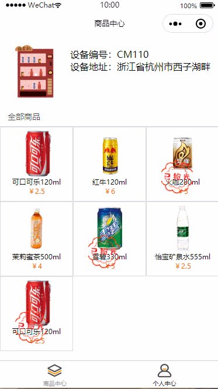

# vmApp
通过扫描自动贩卖机上的小程序码，进入购买界面。

#### 项目演示

#### 未完善功能

支付功能暂未完善

另外，因为我的后端同事太忙了，他没空帮我写接口，使用[easy mock](https://www.easy-mock.com)创建接口，获得模拟数据，我还用不好easy mock,所以模拟响应式数据的时候数据就有点不对...

同事真的太忙了，他已经欠我好多接口了。

